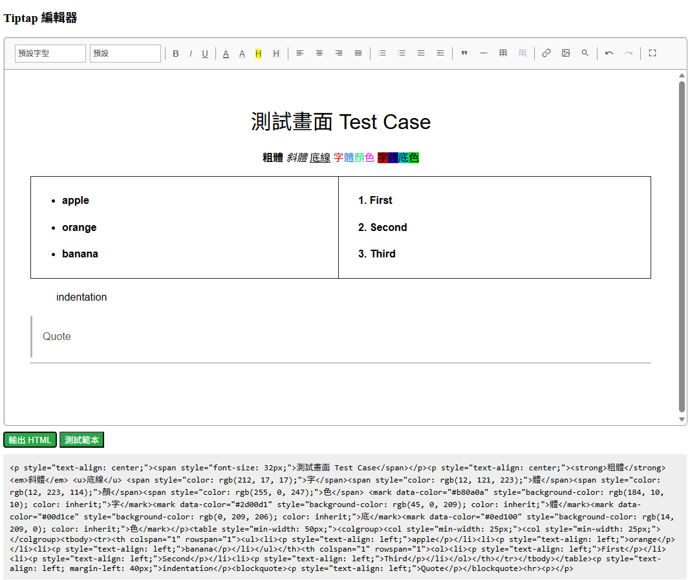
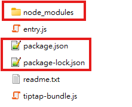
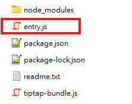
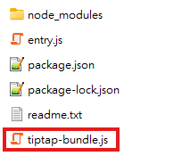

# Pure JS Tiptap Editor
A minimalist rich text editor built using **Tiptap** and **Pure Vanilla JavaScript**. 
## Features
- **Framework-Free / Pure JS**: Built entirely with vanilla JavaScript, providing zero framework overhead and full control over your code.
- **Custom Toolbar**: Fully custom-built UI using vanilla DOM queries and click listeners.

 
---
# 👉 TipTap 套件建置

### **Step 1. 建立臨時資料夾** 
用終端機(Terminal 或命令提示字元)進入該資料夾。

### **Step 2. 下載所有需要的套件**
目前Tiptap有Import這些套件，對應下載的套件。
- Extension
- StarterKit
- Placeholder
- TextStyle, FontSize, Color, BackgroundColor, FontFamily
- TextAlign
- Image
- Dropcursor
- Paragraph
- Link from
- Underline
- Highlight
- TableKit
- Plugin, PluginKey
- Decoration, DecorationSet

在臨時資料夾下載對應套件。
```
npm init -y

npm install @tiptap/core @tiptap/starter-kit @tiptap/extension-placeholder @tiptap/extension-text-style @tiptap/extension-text-align @tiptap/extension-image @tiptap/extensions @tiptap/extension-paragraph @tiptap/extension-link @tiptap/extension-underline @tiptap/extension-highlight @tiptap/extension-table @tiptap/pm
```
產生node_modules、package.json、package-lock.json。




### **Step 3. 建立一個「進入點」檔案 entry.js** 
在臨時資料夾建立一個 entry.js 的檔案，把你需要的所有 import 和想要導出的東西寫進去。
為了讓你在本機開發時方便使用，我們把這些元件通通導出(export)。



### **Step 4. 合併成單一本地檔案** 
在命令提示字元執行 npx esbuild 指令。
這個工具會自動去 node_modules 撈取所有依賴檔案、解決所有內部路徑問題，並合併壓縮成一個檔案 (tiptap-bundle.js)。
```
npx esbuild entry.js --bundle --minify --format=esm --outfile=tiptap-bundle.js
```



### **Step 5. 使用單一本地檔案(tiptap-bundle.js)** 
import 的變數需要用大括號引入。
```
import { Extension } from './core/tiptap-bundle.js'
import { StarterKit } from './core/tiptap-bundle.js'
import { Placeholder } from './core/tiptap-bundle.js'
import { TextStyle, FontSize, Color, BackgroundColor, FontFamily } from './core/tiptap-bundle.js'
import { TextAlign } from './core/tiptap-bundle.js'
import { Image } from './core/tiptap-bundle.js'
import { Dropcursor } from './core/tiptap-bundle.js'
import { Paragraph } from './core/tiptap-bundle.js'
import { Link } from './core/tiptap-bundle.js'
import { Underline } from './core/tiptap-bundle.js'
import { Highlight } from './core/tiptap-bundle.js'
import { TableKit } from './core/tiptap-bundle.js'
import { Plugin, PluginKey } from './core/tiptap-bundle.js'
import { Decoration, DecorationSet } from './core/tiptap-bundle.js';
```

---
# 👉 TipTap 套件使用說明


### **1. editor.js** 
自行建立 editor.js ，初始化文字編輯器，若物件已存在，執行清除並重新建立文字編輯器物件。
可於此處設置文字編輯器基本設定。

### **2. extensions.js**
自行建立 extensions.js ，用於管理引用的套件功能。
可於此處自定義文字編輯器功能或擴充現有功能。
#### import 已建置完成的TipTap套件
```
import { Extension } from './core/tiptap-bundle.js'
import { StarterKit } from './core/tiptap-bundle.js'
import { Placeholder } from './core/tiptap-bundle.js'
...
```
#### 最後導出(export)文字編輯器的擴充元件陣列。
```
export const editorExtensions = [
    StarterKit.configure({
        link: false,
        dropcursor: false,
    }),
    Color,
    TextAlign.configure({
        types: ['heading', 'paragraph'],
        alignments: [
            'left',
            'center',
            'right',
            'justify',
        ],
    }),
    TextStyle,
    FontFamily,
    BackgroundColor,
	...
]
```

---
# 👉 TipTap 頁面設計(Html、CSS)

### 1. 文字編輯器
新增文字編輯器區塊位置。
```
<div class="editor-content" id="tiptap-editor"></div>
```

### 2. 工具列
設計各工具的按鈕、下拉選單、子工具列等...
```
<div class="editor-toolbar" id="toolbar">
	<select id="fontFamilySelect" title="字型" style="font-family: inherit;">
		...
	</select>
	<span class="divider"></span>
	<button id="bold-btn" title="粗體"><b>B</b></button>
	<button id="italic-btn" title="斜體"><i>I</i></button>
	...
</div>

<div class="editor-sub-toolbar" id="link-input-bar">
	...
</div>
```

---
# 👉 TipTap 編輯器功能(JavaScript)

### Tiptap 編輯器載入、監聽、顯示
import editor.js 的建立編輯器方法，並使用該編輯器。
```
<script>
    var editor;
</script>

<script  type="module">
    import { initEditor } from './TiptapEditor/editor.js';
    editor = initEditor();
</script>
```

編輯器功能功能監聽事件，根據不同的功能控制項工具設計各監聽事件，並觸發對應的TipTap功能。
```
// [編輯器功能] 1.字體選擇
	document.getElementById('fontFamilySelect').addEventListener('change', (e) => {
		const selectedFont = e.target.value;
		editor.chain().focus().setFontFamily(selectedFont).run();
	});

// [編輯器功能] 2.字體大小
    document.getElementById('fontSizeSelect').addEventListener('change', (e) => {
        const selectedSize = e.target.value;
        if (selectedSize === '') {
            editor.chain().focus().unsetFontSize().run();
        } else {
            editor.chain().focus().setFontSize(selectedSize).run();
        }
    });
	
 // [編輯器功能] 3.粗體
    document.getElementById('bold-btn').addEventListener('click', () => {
        editor.chain().focus().toggleBold().run()
    });
...
```

顯示邏輯判斷，當編輯器內有變動或調整，根據狀況調整畫面的操作等。
```
// 監聽編輯器的變動，即時更新狀態
    editor.on('transaction', () => {
        // [按鈕]上一步、下一步
        document.getElementById('undo-btn').disabled = !editor.can().undo();
        document.getElementById('redo-btn').disabled = !editor.can().redo();
        // [按鈕]刪除表格
        document.getElementById('deleteTable-btn').disabled = !editor.isActive('table');
        ...
    });
	
// 切換子功能區塊
    function showSubToolbar(targetBarId) {
        // 所有可出現的子功能區塊全部隱藏
        document.getElementById('link-input-bar').style.display = 'none';
        document.getElementById('linkHrefInput').value = '';
        document.getElementById('image-input-bar').style.display = 'none';
		...
	}
```

---
# 👉 額外補充

### 上傳圖片說明

#### 自定義圖片上傳擴充套件
- 於 extensions.js 自定義圖片上傳擴充套件。
```
// 自定義圖片上傳擴充套件
const CustomImageUpload = Extension.create({
    name: 'customImageUpload',
    addStorage() {
        return {
            uploadUrlInput: '',
        };
    },
    addCommands() {
        return {
            // 指令: 呼叫上傳圖片的API方法
            uploadImageFile: (file) => ({ editor }) => {
                coreImageUploadHandler(file, editor, this.storage.uploadUrlInput);
                return true;
            },
            // 設定上傳API的URL
            setUploadUrl: (uploadUrlInput) => () => {
                this.storage.uploadUrlInput = uploadUrlInput;
                return true;
            },
        };
    },
});
```
- 設計 API 傳送內容，發送訊息調整為符合系統的內容。
```
// 宣告發送內容格式
const formData = new FormData();

// 加入後端設計的接收格式(一)(可自行設計刪減)
formData.append('CKEditor_UploadFile', file, file.name);

// 加入後端設計的接收格式(二)(可自行設計刪減)
const newArray = uploadUrlInput.split("/");
const pageType = newArray[1];
const apiParameter = {
    "Page": pageType,
    "MethodName": "UploadPolicy",
    "para": {}
};
formData.append("UploadPolicy", JSON.stringify(apiParameter));

// 加入後端設計的接收格式(三)(可自行設計刪減)
formData.append("checkToken", "token");
```
- Fetch API 上傳且回傳成功後將圖片顯示於編輯器當中
```
// 設定 API 後端接收網址
const realApiUrl = uploadUrlInput;

// Fetch 發送內容
try {
    const response = await fetch(realApiUrl, {
        method: 'POST',
        credentials: 'include',
        body: formData
    });

    if (!response.ok) throw new Error();

    const data = await response.json();

    // 檢查後端回傳並塞入 Tiptap
    if (data.uploaded && data.url) {
        editor.chain().focus().setImage({ src: data.url }).run();
    } else {
        alert('Upload Fail：' + (data.error?.message || 'Fail'));
    }
} catch (error) {
    alert("Upload Fail");
}
```
- API 也可以使用 XHR 方法，XHR API 上傳且回傳成功後將圖片顯示於編輯器當中
```
// 設定 API 後端接收網址
const realApiUrl = uploadUrlInput;

// XHR 發送內容
// 建立 XHR 
const xhr = new XMLHttpRequest();
xhr.open("POST", realApiUrl, true);
// 開啟憑證攜帶
xhr.withCredentials = true;
// 監聽回傳並解析
xhr.onload = function () {
    if (xhr.status >= 200 && xhr.status < 300) {
        try {
            const data = JSON.parse(xhr.responseText);
            if (data.uploaded && data.url) {
                // 成功拿到 URL，插入 Tiptap
                editor.chain().focus().setImage({ src: data.url }).run();
            } else {
                alert('上傳失敗：' + (data.error?.message || '未知錯誤'));
            }
        } catch (e) {
            console.error('解析 Response 失敗', xhr.responseText);
        }
    } else {
        alert('連線失敗，狀態碼：' + xhr.status);
    }
};
// XHR 送出
xhr.send(formData);
```

#### 實際使用方法，設計兩個 commands 方法，先設定後端接收的網址 setUploadUrl() ，再上傳圖片檔案 uploadImageFile()。
```
const fileInput = document.getElementById('imageInput');
fileInput.addEventListener('change', async (event) => {
        // 確保拿到單一檔案
        const file = event.target.files[0];
        if (!file) return;
        // 設定API後端接收網址
        editor.commands.setUploadUrl('aaa/test');
        // 呼叫自定義上傳圖片指令
        editor.commands.uploadImageFile(file);
        // 清空 input 使同一張圖能重複選取觸發
        fileInput.value = '';
    });
```
